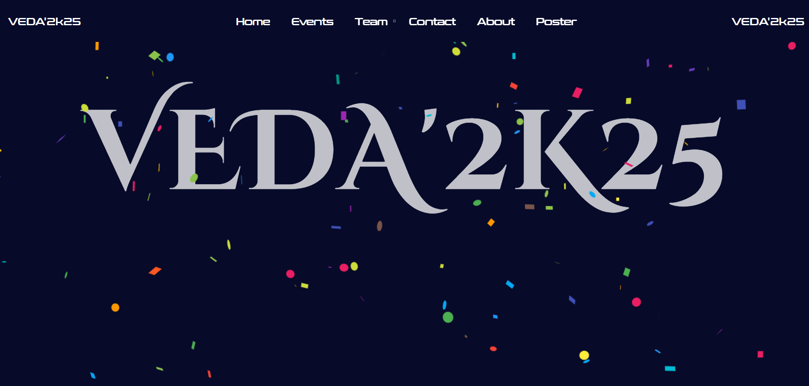
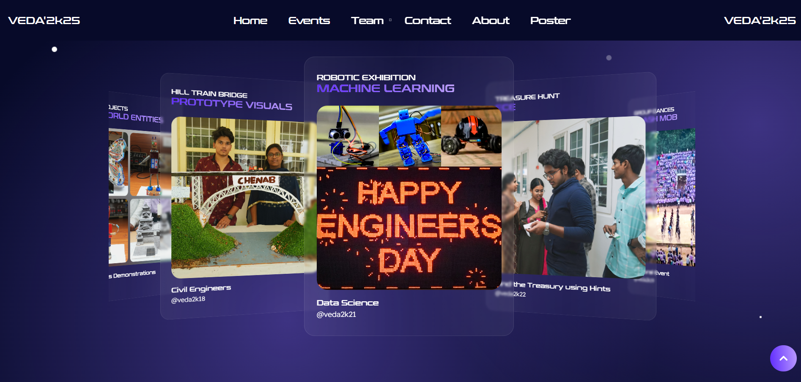
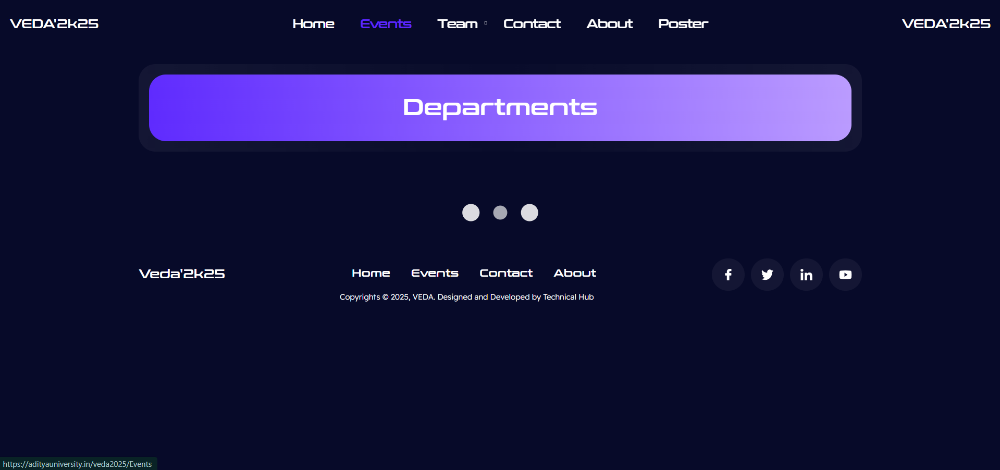
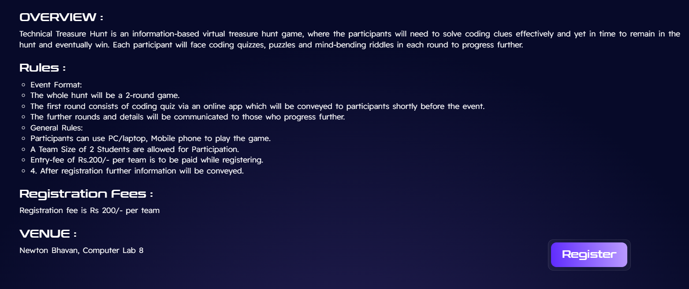
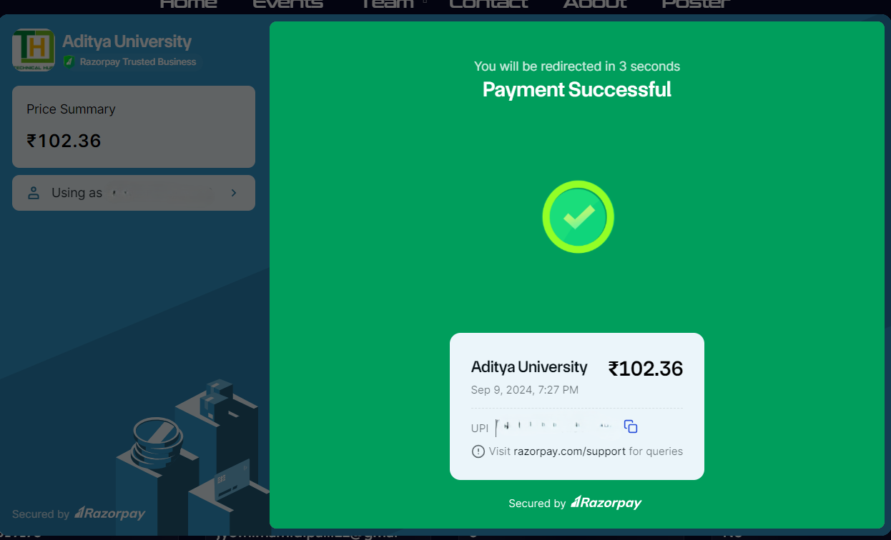
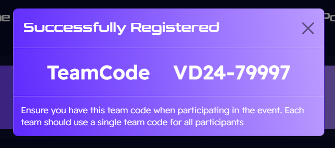
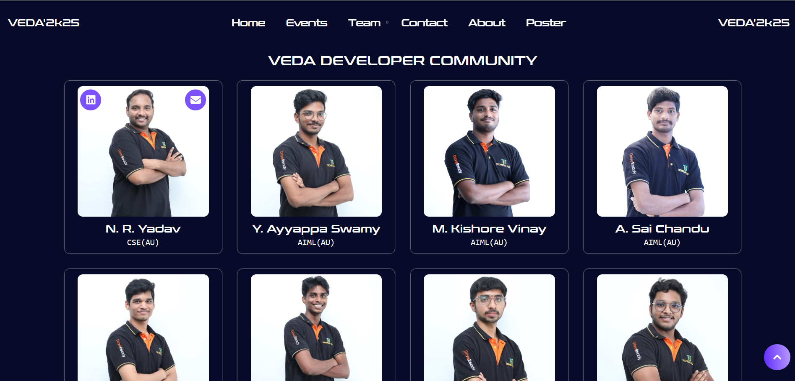
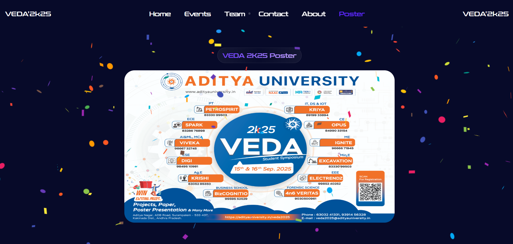
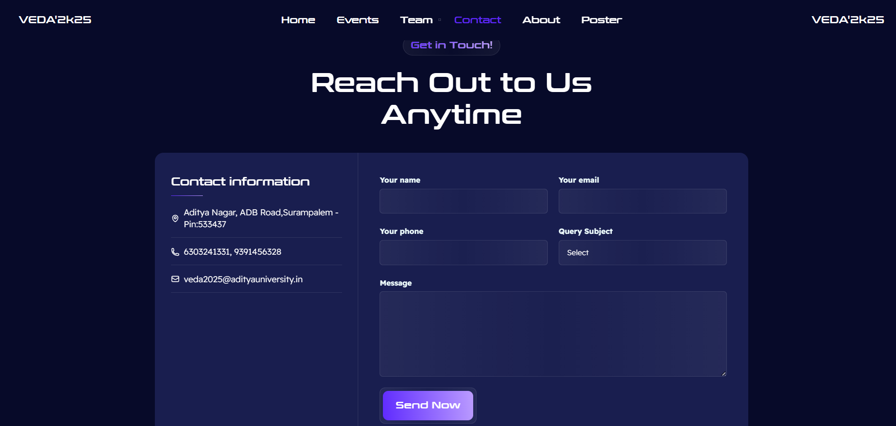

<h1 align="center">🎆 VEDA 2K25 - Frontend</h1>
<h3 align="center">A Student Event Registration Website for Aditya University</h3>
 
<p align="center">
  <a href="https://adityauniversity.in/veda2025" target="_blank">
    🔗 Live Demo
  </a>
</p>

---

## 📌 Overview

VEDA 2K25 (2025) is a **MERN Stack Based Web Application** developed to manage events registrations, payments at university during the event called VEDA (organised by Aditya university every year on the eve of Birth Anniversary of Dr. Sarvepalli Radha Krishnan also known for National Engineer's Day) efficiently. It enables **Real-Time Payments**, **Automated Dashboard Logs**, and **Role-Based Portal Logins** for Admins, Students, and Faculties.

---

## 🧠 Event Statistics

- 🧑‍💼 **12,190+** – Students Registered
- 🚌 **5859** – Teams Participating
- 📍 **1500+** – Payments Successfully Handled
- 📊 **400+** – Faculty & Student Coordinators
- 📨 **90** – Exciting Events Lined Up

---

## 🖼️ Screenshots

### Home Page:


### VEDA 2K25 (Scroll trigger animation):


### Events at VEDA


### Department Loader


### Event Instructions


### Secure RazorPay Payments


### Unique Team Code


### Developer Community


### VEDA 2K25 Poster


### Query Contact Page



---


## 🧠 Key Features

- 🧑‍💼 **Role-Based Dashboards** – Admin, Faculty, and Student
- 🚌 **Real-Time Payments** – Integrated with Razorpay Payments Securely
- 📍 **Route Mapping** – Using Google Maps API for Event Locations
- 🧾 **Digital Boarding Logs** – Auto-updated with timestamps
- 📊 **Analytics Dashboard for Admin** – Easy to Filter and Categorize 
- 📨 **Contact and Feedback Form with Email Integration** – Quick Query Support

---

## 🔧 Tech Stack

| Technology | Description |
|------------|-------------|
| **Frontend** | React.js, HTML5, CSS3, JavaScript |
| **Backend**  | Node.js, Express.js |
| **Database** | MongoDB |
| **Payment Integration** | RazorPay Module for Secure Payments |
| **Authentication** | JWT, Bcrypt |

---

## 🌐 Live Demo

▶️ [https://adityauniversity.in/veda2025](https://adityauniversity.in/veda2025)

---

###  Clone the Repository

```bash
git clone https://github.com/nryadav18/veda_frontend.git
```

### Install Dependencies
```bash
npm install
```

### Run the Frontend
```bash
npm run dev
```
